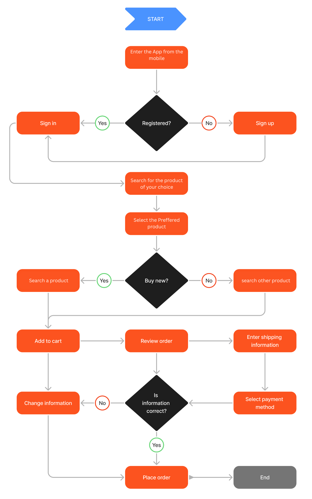

# 🛍️ Flutter E-Commerce Mobile Application

A modern, cross-platform mobile e-commerce application built with Flutter and Firebase, offering a seamless shopping experience with real-time data synchronization and secure transactions.

## 📱 About The Project

This project delivers a comprehensive mobile-first e-commerce solution that redefines online shopping through intuitive design and powerful features. Built with Flutter's cross-platform capabilities and Firebase's robust backend infrastructure, the app provides users with a fast, secure, and engaging shopping experience.

## 🎯 Features

### 🔐 Authentication & User Management
- Email/password registration and login
- Password reset and email verification
- Persistent session management
- Secure user data protection

### 🏪 Product Browsing & Discovery
- Dynamic product catalog with real-time updates
- Grid and list view layouts
- Category-based filtering
- Advanced search functionality with tags
- Pull-to-refresh for latest products
- Detailed product pages with images, pricing, and specifications

### 🛒 Shopping Cart & Checkout
- Add, remove, and update product quantities
- Real-time cart total calculation
- Order summary with itemized details
- Address entry with validation
- Secure checkout process
- Order placement with status tracking

### 👤 Profile Management
- View and edit personal information
- Update contact details and addresses
- Order history tracking
- Real-time profile synchronization

## 🏗️ System Architecture

The application follows a modular architecture with clear separation of concerns:

## 🛠️ Technology Stack

### Frontend
- *Framework*: Flutter SDK
- *Language*: Dart
- *State Management*: Provider / BLoC (specify your choice)
- *UI Components*: Material Design widgets

### Backend & Services
- *Authentication*: Firebase Authentication
- *Database*: Cloud Firestore (NoSQL)
- *Storage*: Firebase Storage
- *Cloud Functions*: Firebase Cloud Functions
- *Analytics*: Firebase Analytics
- *Notifications*: Firebase Cloud Messaging (FCM)

## 📸 App Preview

  

## 📧 Contact

Deepa Kumawat - [@DeepaKumawat89](https://github.com/DeepaKumawat89)

Project Link: [https://github.com/DeepaKumawat89/E_commerce-App](https://github.com/DeepaKumawat89/E_commerce-App)

Made with ❤️ using Flutter and Firebase

